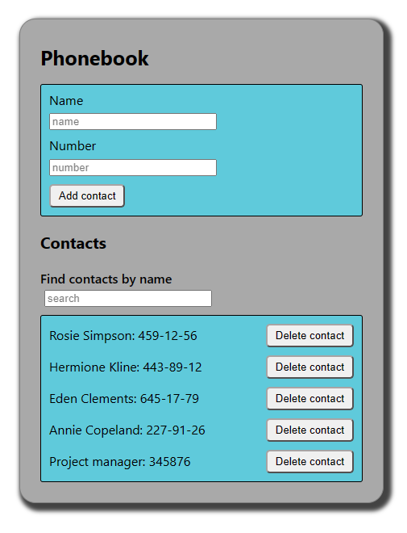

# Phonebook

Can't remember all the important contacts? Want to add some new? Try this basic
phonebook app now!

## Demo

Check it out:
(https://weronikakingrzegorek.github.io/goit-react-hw-04-phonebook/)

## Preview

## Description

Simply put the name and number and click "Add contact" (App will add contact to
your list). Use filter and find the contact you're looking for. Anytime you want
to delete contact - just click "Delete contact"! It's that simple!

## Created with

React, JS, HTML, CSS.

## Setup

Clone this repo to your desktop and run npm install to install all the
dependencies.

Next run npm start to start the app.

Finally, acces it at localhost:3000.
